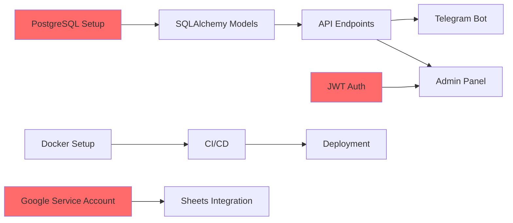

# План разработки и график Telegram Store MVP

**Версия документа:** 1.0  
**Дата:** 2025-11-30  
**Длительность MVP:** 4 недели (160 человеко-часов)

---

## Содержание

1. [Обзор проекта](#обзор-проекта)
2. [Команда и роли](#команда-и-роли)
3. [Методология разработки](#методология-разработки)
4. [Детальный план по спринтам](#детальный-план-по-спринтам)
5. [Оценка человеко-часов](#оценка-человеко-часов)
6. [Критические зависимости](#критические-зависимости)
7. [Риски и митигация](#риски-и-митигация)
8. [Roadmap фаз 2-3](#roadmap-фаз-2-3)
9. [Метрики успеха](#метрики-успеха)

---

## Обзор проекта

### Цель MVP
Создать функциональный Telegram-магазин с минимальным набором возможностей для запуска продаж через Telegram Bot и управления через веб-панель администратора.

### Ключевые возможности MVP
- ✅ Telegram Bot для клиентов (каталог, корзина, оформление заказа)
- ✅ Backend API (FastAPI) с REST endpoints
- ✅ PostgreSQL база данных с поддержкой вариантов продуктов
- ✅ Admin Panel (React) для управления каталогом и заказами
- ✅ Импорт/экспорт данных (CSV, XLSX, Google Sheets)
- ✅ Интеграция с аналитикой (GA4, Yandex Metrika)
- ✅ JWT аутентификация для админов
- ✅ Webhook для Telegram Bot

### Что НЕ входит в MVP
- ❌ Онлайн-платежи (фаза 2)
- ❌ Интеграция с доставкой (фаза 2)
- ❌ Интеграция с 1C (фаза 3)
- ❌ Мультиязычность (фаза 3)
- ❌ LLM-ассистент (фаза 3)
- ❌ Мобильное приложение

---

## Команда и роли

### Состав команды (4 человека)

| Роль | Ответственность | Загрузка |
|------|----------------|----------|
| **Backend Developer** | FastAPI, PostgreSQL, интеграции, Telegram Bot логика | 100% (160ч) |
| **Frontend Developer** | React Admin Panel, UI/UX | 75% (120ч) |
| **DevOps Engineer** | Инфраструктура, CI/CD, мониторинг | 50% (80ч) |
| **QA Engineer** | Тестирование, документация тест-кейсов | 50% (80ч) |

**Общая загрузка:** 440 человеко-часов

### Дополнительные роли (по необходимости)
- **Product Owner:** Приоритизация задач, приемка результатов
- **UI/UX Designer:** Дизайн Admin Panel (может быть выполнено Frontend Dev)

---

## Методология разработки

### Agile / Scrum
- **Длительность спринта:** 1 неделя
- **Всего спринтов:** 4
- **Daily Standups:** Ежедневно 15 минут
- **Sprint Planning:** Понедельник, начало спринта (1 час)
- **Sprint Review:** Пятница, конец спринта (1 час)
- **Sprint Retrospective:** Пятница, после Review (30 минут)

### Инструменты
- **Управление задачами:** Jira / Linear / GitHub Projects
- **Контроль версий:** Git (GitHub / GitLab)
- **CI/CD:** GitHub Actions / GitLab CI
- **Коммуникация:** Slack / Telegram
- **Документация:** Confluence / Notion

---

## Детальный план по спринтам

### 📅 Спринт 1: Фундамент и Backend API (Неделя 1)

**Цель:** Создать базовую инфраструктуру, настроить БД, разработать core API endpoints.

#### Задачи Backend Developer (40 часов)

| Задача | Описание | Часы | Приоритет |
|--------|----------|------|-----------|
| **BACK-1** | Настройка проекта (структура, requirements.txt, .env) | 2 | P0 |
| **BACK-2** | Настройка PostgreSQL, создание схемы БД | 4 | P0 |
| **BACK-3** | SQLAlchemy модели (users, products, variants, orders) | 6 | P0 |
| **BACK-4** | Alembic миграции | 2 | P0 |
| **BACK-5** | Pydantic схемы для валидации | 4 | P0 |
| **BACK-6** | FastAPI app setup, CORS, middleware | 2 | P0 |
| **BACK-7** | Endpoints: GET /products, GET /products/{id} | 4 | P0 |
| **BACK-8** | Endpoints: GET /categories | 2 | P1 |
| **BACK-9** | Endpoints: POST /orders | 6 | P0 |
| **BACK-10** | JWT аутентификация (login, refresh) | 6 | P0 |
| **BACK-11** | Unit тесты для API endpoints | 2 | P1 |

#### Задачи DevOps Engineer (20 часов)

| Задача | Описание | Часы | Приоритет |
|--------|----------|------|-----------|
| **DEVOPS-1** | Настройка VPS (Ubuntu, firewall, SSH) | 3 | P0 |
| **DEVOPS-2** | Установка PostgreSQL, Redis | 2 | P0 |
| **DEVOPS-3** | Docker и Docker Compose конфигурация | 4 | P0 |
| **DEVOPS-4** | Настройка CI/CD pipeline (GitHub Actions) | 6 | P1 |
| **DEVOPS-5** | Настройка staging окружения | 3 | P1 |
| **DEVOPS-6** | Документация по развертыванию | 2 | P1 |

#### Задачи QA Engineer (10 часов)

| Задача | Описание | Часы | Приоритет |
|--------|----------|------|-----------|
| **QA-1** | Создание тест-плана для MVP | 3 | P0 |
| **QA-2** | Подготовка тестовых данных (продукты, категории) | 2 | P1 |
| **QA-3** | Тестирование API endpoints (Postman) | 3 | P1 |
| **QA-4** | Документация найденных багов | 2 | P1 |

#### Deliverables Спринт 1
- ✅ Работающий Backend API с базовыми endpoints
- ✅ База данных с миграциями
- ✅ JWT аутентификация
- ✅ Docker Compose конфигурация
- ✅ CI/CD pipeline

---

### 📅 Спринт 2: Telegram Bot и Admin API (Неделя 2)

**Цель:** Разработать Telegram Bot с FSM, добавить административные endpoints.

#### Задачи Backend Developer (40 часов)

| Задача | Описание | Часы | Приоритет |
|--------|----------|------|-----------|
| **BACK-12** | Настройка aiogram 3, webhook endpoint | 4 | P0 |
| **BACK-13** | FSM для выбора вариантов продукта | 6 | P0 |
| **BACK-14** | Handlers: /start, каталог, просмотр продукта | 6 | P0 |
| **BACK-15** | Корзина (добавление, просмотр, изменение) | 6 | P0 |
| **BACK-16** | Checkout flow (имя, телефон, адрес) | 6 | P0 |
| **BACK-17** | Интеграция бота с API (создание заказа) | 4 | P0 |
| **BACK-18** | Admin endpoints: GET/POST/PUT/DELETE /admin/products | 6 | P0 |
| **BACK-19** | Admin endpoints: GET/PATCH /admin/orders | 2 | P0 |

#### Задачи Frontend Developer (30 часов)

| Задача | Описание | Часы | Приоритет |
|--------|----------|------|-----------|
| **FRONT-1** | Настройка React проекта (Create React App / Vite) | 2 | P0 |
| **FRONT-2** | Настройка роутинга (React Router) | 2 | P0 |
| **FRONT-3** | Axios setup, API client | 2 | P0 |
| **FRONT-4** | Страница логина (форма, валидация) | 4 | P0 |
| **FRONT-5** | JWT token management (localStorage, interceptors) | 4 | P0 |
| **FRONT-6** | Layout компонент (header, sidebar, main) | 4 | P1 |
| **FRONT-7** | Dashboard (заглушка с метриками) | 4 | P1 |
| **FRONT-8** | UI Kit setup (Material-UI / Ant Design) | 4 | P1 |
| **FRONT-9** | Responsive design для мобильных | 4 | P2 |

#### Задачи DevOps Engineer (20 часов)

| Задача | Описание | Часы | Приоритет |
|--------|----------|------|-----------|
| **DEVOPS-7** | Настройка Nginx как reverse proxy | 4 | P0 |
| **DEVOPS-8** | SSL сертификаты (Let's Encrypt) | 3 | P0 |
| **DEVOPS-9** | Настройка systemd для автозапуска | 3 | P0 |
| **DEVOPS-10** | Настройка логирования (logrotate) | 2 | P1 |
| **DEVOPS-11** | Мониторинг (Prometheus + Grafana setup) | 6 | P2 |
| **DEVOPS-12** | Backup скрипты для PostgreSQL | 2 | P1 |

#### Задачи QA Engineer (20 часов)

| Задача | Описание | Часы | Приоритет |
|--------|----------|------|-----------|
| **QA-5** | Тестирование Telegram Bot (все сценарии) | 8 | P0 |
| **QA-6** | Тестирование Admin API endpoints | 4 | P0 |
| **QA-7** | Интеграционное тестирование (Bot + API) | 4 | P0 |
| **QA-8** | Регрессионное тестирование | 2 | P1 |
| **QA-9** | Обновление тест-документации | 2 | P1 |

#### Deliverables Спринт 2
- ✅ Полностью функциональный Telegram Bot
- ✅ Административные API endpoints
- ✅ Базовая структура Admin Panel
- ✅ Nginx + SSL настроены
- ✅ Systemd сервисы

---

### 📅 Спринт 3: Admin Panel и Интеграции (Неделя 3)

**Цель:** Завершить Admin Panel, добавить импорт/экспорт, интеграции с аналитикой.

#### Задачи Backend Developer (40 часов)

| Задача | Описание | Часы | Приоритет |
|--------|----------|------|-----------|
| **BACK-20** | Google Sheets API интеграция (Service Account) | 6 | P0 |
| **BACK-21** | Импорт продуктов из Google Sheets | 6 | P0 |
| **BACK-22** | Экспорт заказов в Google Sheets | 4 | P0 |
| **BACK-23** | CSV/XLSX импорт (pandas, openpyxl) | 6 | P0 |
| **BACK-24** | CSV/XLSX экспорт | 4 | P0 |
| **BACK-25** | Google Analytics (GA4) интеграция | 4 | P1 |
| **BACK-26** | Yandex Metrika интеграция | 4 | P1 |
| **BACK-27** | Background tasks для импорта (FastAPI BackgroundTasks) | 4 | P1 |
| **BACK-28** | Уведомления админам в Telegram | 2 | P1 |

#### Задачи Frontend Developer (30 часов)

| Задача | Описание | Часы | Приоритет |
|--------|----------|------|-----------|
| **FRONT-10** | Страница списка продуктов (таблица, пагинация) | 6 | P0 |
| **FRONT-11** | Страница создания/редактирования продукта | 8 | P0 |
| **FRONT-12** | Управление вариантами продукта (динамические поля) | 6 | P0 |
| **FRONT-13** | Страница списка заказов (фильтры, поиск) | 4 | P0 |
| **FRONT-14** | Страница детального просмотра заказа | 3 | P0 |
| **FRONT-15** | Изменение статуса заказа | 3 | P0 |

#### Задачи DevOps Engineer (20 часов)

| Задача | Описание | Часы | Приоритет |
|--------|----------|------|-----------|
| **DEVOPS-13** | Production deployment | 6 | P0 |
| **DEVOPS-14** | Настройка мониторинга метрик (CPU, RAM, disk) | 4 | P1 |
| **DEVOPS-15** | Настройка алертов (email/Telegram при ошибках) | 4 | P1 |
| **DEVOPS-16** | Performance тестирование (load testing) | 4 | P2 |
| **DEVOPS-17** | Документация по troubleshooting | 2 | P1 |

#### Задачи QA Engineer (20 часов)

| Задача | Описание | Часы | Приоритет |
|--------|----------|------|-----------|
| **QA-10** | Тестирование Admin Panel (все страницы) | 8 | P0 |
| **QA-11** | Тестирование импорта/экспорта | 6 | P0 |
| **QA-12** | Тестирование интеграций (GA4, Yandex) | 3 | P1 |
| **QA-13** | Security тестирование (OWASP Top 10) | 3 | P1 |

#### Deliverables Спринт 3
- ✅ Полностью функциональная Admin Panel
- ✅ Импорт/экспорт данных
- ✅ Интеграции с аналитикой
- ✅ Production deployment
- ✅ Мониторинг и алерты

---

### 📅 Спринт 4: Тестирование, Оптимизация, Запуск (Неделя 4)

**Цель:** Финальное тестирование, исправление багов, оптимизация, подготовка к запуску.

#### Задачи Backend Developer (40 часов)

| Задача | Описание | Часы | Приоритет |
|--------|----------|------|-----------|
| **BACK-29** | Исправление критических багов | 10 | P0 |
| **BACK-30** | Оптимизация SQL запросов (индексы) | 6 | P0 |
| **BACK-31** | Добавление rate limiting | 4 | P1 |
| **BACK-32** | Улучшение обработки ошибок | 4 | P1 |
| **BACK-33** | Документация API (OpenAPI/Swagger) | 4 | P1 |
| **BACK-34** | Code review и рефакторинг | 6 | P1 |
| **BACK-35** | Подготовка seed данных для демо | 2 | P2 |
| **BACK-36** | Финальное тестирование всех endpoints | 4 | P0 |

#### Задачи Frontend Developer (30 часов)

| Задача | Описание | Часы | Приоритет |
|--------|----------|------|-----------|
| **FRONT-16** | Исправление UI багов | 8 | P0 |
| **FRONT-17** | Страница импорта/экспорта | 6 | P0 |
| **FRONT-18** | Улучшение UX (loading states, error messages) | 6 | P0 |
| **FRONT-19** | Оптимизация производительности (lazy loading) | 4 | P1 |
| **FRONT-20** | Финальный UI polish | 4 | P1 |
| **FRONT-21** | Build для production | 2 | P0 |

#### Задачи DevOps Engineer (20 часов)

| Задача | Описание | Часы | Приоритет |
|--------|----------|------|-----------|
| **DEVOPS-18** | Финальная настройка production окружения | 4 | P0 |
| **DEVOPS-19** | Проверка backup/restore процедур | 3 | P0 |
| **DEVOPS-20** | Настройка CDN для статики (опционально) | 4 | P2 |
| **DEVOPS-21** | Документация по эксплуатации | 4 | P0 |
| **DEVOPS-22** | Runbook для инцидентов | 3 | P1 |
| **DEVOPS-23** | Финальный security audit | 2 | P0 |

#### Задачи QA Engineer (30 часов)

| Задача | Описание | Часы | Приоритет |
|--------|----------|------|-----------|
| **QA-14** | Полное регрессионное тестирование | 10 | P0 |
| **QA-15** | User Acceptance Testing (UAT) | 6 | P0 |
| **QA-16** | Performance тестирование | 4 | P1 |
| **QA-17** | Тестирование на разных устройствах | 4 | P1 |
| **QA-18** | Финальная проверка всех сценариев | 4 | P0 |
| **QA-19** | Подготовка релизных заметок | 2 | P1 |

#### Deliverables Спринт 4
- ✅ Все критические баги исправлены
- ✅ Оптимизированная производительность
- ✅ Полная документация
- ✅ Production-ready система
- ✅ Готовность к запуску

---

## Оценка человеко-часов

### Распределение по ролям

| Роль | Спринт 1 | Спринт 2 | Спринт 3 | Спринт 4 | **Итого** |
|------|----------|----------|----------|----------|-----------|
| Backend Developer | 40ч | 40ч | 40ч | 40ч | **160ч** |
| Frontend Developer | 0ч | 30ч | 30ч | 30ч | **90ч** |
| DevOps Engineer | 20ч | 20ч | 20ч | 20ч | **80ч** |
| QA Engineer | 10ч | 20ч | 20ч | 30ч | **80ч** |
| **Итого по спринту** | **70ч** | **110ч** | **110ч** | **120ч** | **410ч** |

### Распределение по типам задач

| Тип задачи | Часы | % от общего |
|------------|------|-------------|
| Backend разработка | 160ч | 39% |
| Frontend разработка | 90ч | 22% |
| DevOps и инфраструктура | 80ч | 20% |
| Тестирование и QA | 80ч | 20% |
| **Итого** | **410ч** | **100%** |

### Буфер на непредвиденные задачи

- **Рекомендуемый буфер:** 20% (82 часа)
- **Общая оценка с буфером:** 492 часа

---

## Критические зависимости

### Технические зависимости



### Критический путь (Critical Path)

1. **День 1-2:** Настройка БД и базовых моделей
2. **День 3-5:** Core API endpoints
3. **День 6-7:** JWT аутентификация
4. **День 8-10:** Telegram Bot основной функционал
5. **День 11-14:** Admin Panel базовая структура
6. **День 15-17:** Импорт/экспорт
7. **День 18-20:** Интеграции
8. **День 21-28:** Тестирование и оптимизация

### Блокеры

| Блокер | Влияние | Митигация |
|--------|---------|-----------|
| Задержка с доступом к серверу | Высокое | Подготовить сервер заранее, использовать Docker локально |
| Проблемы с Google API | Среднее | Настроить Service Account в первые дни |
| Недоступность Telegram API | Критическое | Использовать polling для разработки, webhook для production |
| Изменение требований | Высокое | Фиксация scope MVP, change request процесс |

---

## Риски и митигация

### Технические риски

| Риск | Вероятность | Влияние | Митигация |
|------|-------------|---------|-----------|
| Проблемы с производительностью БД | Средняя | Высокое | Оптимизация запросов, индексы, connection pooling |
| Сложности с FSM в aiogram | Средняя | Среднее | Изучение документации, использование aiogram-dialog |
| Проблемы с CORS в Admin Panel | Низкая | Низкое | Правильная настройка FastAPI CORS middleware |
| Превышение лимитов Google Sheets API | Низкая | Среднее | Batch операции, кэширование |
| SSL сертификаты не обновляются | Низкая | Высокое | Автоматизация через certbot, мониторинг срока действия |

### Организационные риски

| Риск | Вероятность | Влияние | Митигация |
|------|-------------|---------|-----------|
| Болезнь члена команды | Средняя | Высокое | Кросс-тренинг, документация, парное программирование |
| Изменение приоритетов | Средняя | Среднее | Четкий scope MVP, Product Owner принимает решения |
| Недооценка задач | Высокая | Среднее | 20% буфер, ежедневные standups для раннего выявления |
| Задержка с внешними зависимостями | Низкая | Среднее | Раннее тестирование интеграций |

### План реагирования на риски

1. **Еженедельный risk review** на Sprint Planning
2. **Escalation path:** Team Lead → Product Owner → Stakeholders
3. **Contingency plan:** Готовность убрать некритичные фичи из MVP

---

## Roadmap фаз 2-3

### 📈 Фаза 2: Расширение функциональности (4-6 недель)

**Приоритет:** Монетизация и улучшение UX

#### Основные фичи

| Фича | Описание | Оценка | Приоритет |
|------|----------|--------|-----------|
| **Платежные системы** | Интеграция YooKassa, Stripe | 40ч | P0 |
| **Онлайн-касса (54-ФЗ)** | Интеграция с ОФД, фискализация | 60ч | P0 |
| **История заказов для клиентов** | Просмотр статуса в боте | 20ч | P1 |
| **Промокоды и скидки** | Система скидок | 30ч | P1 |
| **Отзывы и рейтинги** | Отзывы на продукты | 25ч | P2 |
| **Интеграция с доставкой** | CDEK, Boxberry API | 40ч | P1 |
| **Push-уведомления** | Маркетинговые рассылки | 15ч | P2 |
| **Расширенная аналитика** | Дашборд с метриками продаж | 30ч | P1 |

**Общая оценка фазы 2:** 260 часов (6-7 недель)

### 🚀 Фаза 3: Масштабирование и автоматизация (6-8 недель)

**Приоритет:** Автоматизация и расширение рынка

#### Основные фичи

| Фича | Описание | Оценка | Приоритет |
|------|----------|--------|-----------|
| **Интеграция с 1C** | Синхронизация каталога и заказов | 80ч | P0 |
| **Мультиязычность** | Поддержка EN, RU, другие языки | 40ч | P1 |
| **Мультивалютность** | Поддержка USD, EUR, RUB | 30ч | P1 |
| **LLM-ассистент** | AI помощник для клиентов | 60ч | P2 |
| **Рекомендательная система** | Персонализированные рекомендации | 50ч | P2 |
| **CRM интеграция** | Kommo, Bitrix24 | 40ч | P1 |
| **Abandoned cart recovery** | Автоматические напоминания | 25ч | P1 |
| **Управление складами** | Мультискладская логистика | 70ч | P1 |
| **Мобильное приложение** | iOS/Android (React Native) | 200ч | P2 |

**Общая оценка фазы 3:** 595 часов (12-15 недель)

### Долгосрочный Roadmap (6-12 месяцев)

```
MVP (4 недели)
    ↓
Фаза 2 (6-7 недель) - Платежи, доставка, промокоды
    ↓
Фаза 3 (12-15 недель) - 1C, мультиязычность, LLM
    ↓
Масштабирование (ongoing) - Оптимизация, новые фичи
```

---

## Метрики успеха

### Технические метрики

| Метрика | Целевое значение | Измерение |
|---------|------------------|-----------|
| API Response Time (p95) | < 500ms | Prometheus |
| Bot Response Time | < 2s | Логи |
| Admin Panel Load Time | < 3s | Lighthouse |
| Database Query Time (p95) | < 100ms | PostgreSQL logs |
| Uptime | > 99.5% | Мониторинг |
| Error Rate | < 1% | Sentry |

### Бизнес-метрики (после запуска)

| Метрика | Целевое значение | Период |
|---------|------------------|--------|
| Количество заказов | 50+ | Первый месяц |
| Конверсия (просмотр → заказ) | > 5% | Первый месяц |
| Средний чек | Зависит от каталога | Первый месяц |
| Retention Rate | > 20% | Первые 3 месяца |
| NPS (Net Promoter Score) | > 30 | Первые 3 месяца |

### Качественные метрики

- ✅ Все критические user stories реализованы
- ✅ 0 критических багов в production
- ✅ Документация полная и актуальная
- ✅ Команда готова к поддержке и развитию
- ✅ Положительные отзывы от первых пользователей

---

## Процесс приемки (Definition of Done)

### Для каждой задачи

- [ ] Код написан и соответствует стандартам
- [ ] Code review пройден
- [ ] Unit тесты написаны и проходят
- [ ] Интеграционные тесты проходят
- [ ] Документация обновлена
- [ ] QA тестирование пройдено
- [ ] Нет критических багов
- [ ] Задача задеплоена на staging

### Для каждого спринта

- [ ] Все P0 задачи завершены
- [ ] Sprint Review проведен
- [ ] Демо показано Product Owner
- [ ] Retrospective проведена
- [ ] Backlog обновлен для следующего спринта

### Для MVP

- [ ] Все функциональные требования реализованы
- [ ] Все критические баги исправлены
- [ ] Performance требования выполнены
- [ ] Security audit пройден
- [ ] Документация полная
- [ ] Production deployment успешен
- [ ] UAT пройден
- [ ] Готовность к запуску подтверждена

---

## Контакты и коммуникация

### Ключевые встречи

| Встреча | Частота | Участники | Длительность |
|---------|---------|-----------|--------------|
| Daily Standup | Ежедневно | Вся команда | 15 мин |
| Sprint Planning | Начало спринта | Вся команда + PO | 1 час |
| Sprint Review | Конец спринта | Вся команда + Stakeholders | 1 час |
| Retrospective | Конец спринта | Вся команда | 30 мин |
| Tech Sync | 2 раза в неделю | Backend + Frontend + DevOps | 30 мин |

### Каналы коммуникации

- **Срочные вопросы:** Telegram группа
- **Задачи и баги:** Jira
- **Документация:** Confluence
- **Code Review:** GitHub Pull Requests
- **Общие обсуждения:** Slack

---

## Заключение

Данный план разработки обеспечивает структурированный подход к созданию Telegram Store MVP за 4 недели. Ключевые факторы успеха:

1. **Четкий scope** - фокус на MVP, отложенные фичи в фазы 2-3
2. **Сбалансированная команда** - все необходимые роли покрыты
3. **Agile подход** - гибкость и адаптация к изменениям
4. **Риск-менеджмент** - проактивное управление рисками
5. **Качество** - тестирование на каждом этапе

**Следующие шаги:**
1. Утверждение плана с Product Owner
2. Формирование команды
3. Подготовка инфраструктуры
4. Kick-off встреча
5. Старт Спринта 1

---

**Версия:** 1.0  
**Последнее обновление:** 2025-11-30  
**Ответственный:** Project Manager / Tech Lead
