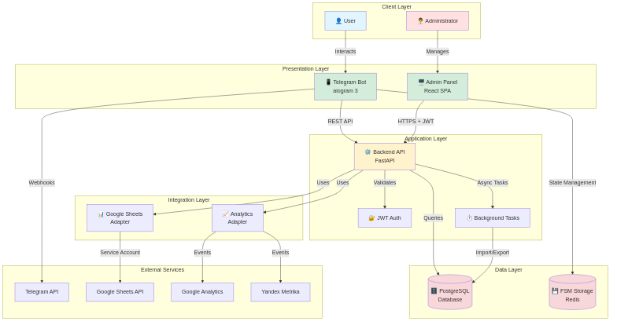
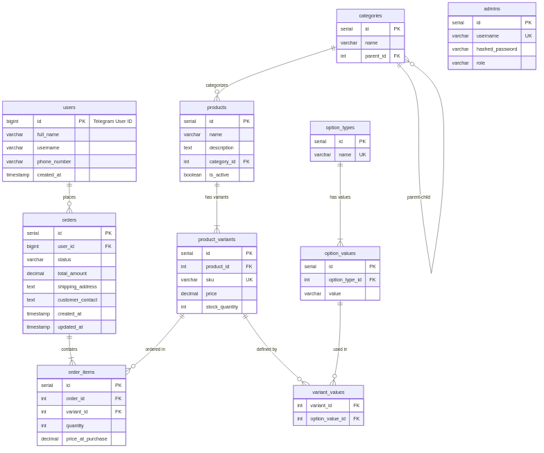
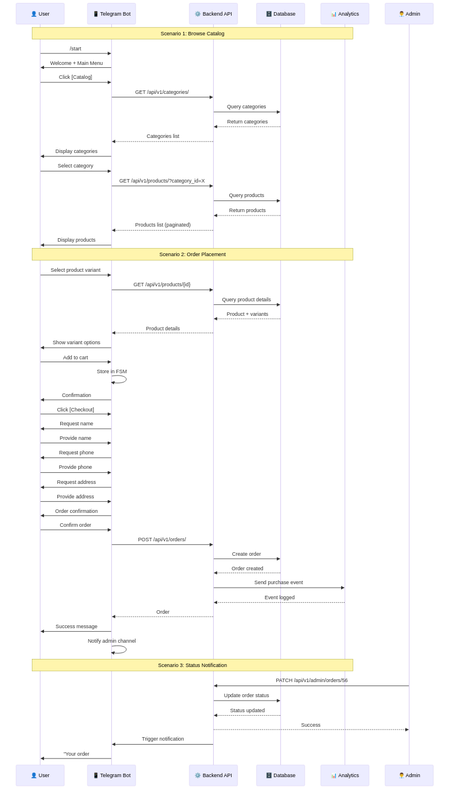

# Telegram Store MVP

> Полнофункциональный интернет-магазин в Telegram с веб-панелью администратора

[](https://www.python.org/downloads/)
[](https://fastapi.tiangolo.com/)
[](https://www.postgresql.org/)
[](https://reactjs.org/)
[](LICENSE)

---

## 📋 Содержание

- [О проекте](#о-проекте)
- [Основные возможности](#основные-возможности)
- [Технологический стек](#технологический-стек)
- [Архитектура](#архитектура)
- [Быстрый старт](#быстрый-старт)
- [Структура проекта](#структура-проекта)
- [Документация](#документация)
- [Roadmap](#roadmap)
- [Вклад в проект](#вклад-в-проект)
- [Лицензия](#лицензия)
- [Контакты](#контакты)

---

## 🎯 О проекте

**Telegram Store MVP** — это современное решение для запуска интернет-магазина в экосистеме Telegram. Проект позволяет клиентам просматривать каталог, добавлять товары в корзину и оформлять заказы прямо в Telegram Bot, а администраторам — управлять каталогом и заказами через удобную веб-панель.

### Зачем это нужно?

- 🚀 **Быстрый запуск** — от идеи до первых продаж за 4 недели
- 💰 **Низкий порог входа** — не нужен отдельный сайт или мобильное приложение
- 📱 **Удобство для клиентов** — покупки прямо в привычном мессенджере
- 📊 **Аналитика** — интеграция с Google Analytics и Yandex Metrika
- 🔒 **Безопасность** — соответствие 152-ФЗ, шифрование данных

---

## ✨ Основные возможности

### Для клиентов (Telegram Bot)

- ✅ Просмотр каталога продуктов по категориям
- ✅ Детальная информация о продукте с изображениями
- ✅ Выбор вариантов продукта (размер, цвет и т.д.)
- ✅ Корзина с возможностью изменения количества
- ✅ Оформление заказа с указанием контактов и адреса доставки
- ✅ Уведомления об изменении статуса заказа
- ✅ Интуитивный интерфейс с inline-кнопками

### Для администраторов (Web Panel)

- ✅ Безопасная аутентификация (JWT)
- ✅ Dashboard с ключевыми метриками
- ✅ Управление каталогом продуктов и вариантами
- ✅ Управление заказами (просмотр, изменение статуса)
- ✅ Импорт продуктов из CSV, XLSX, Google Sheets
- ✅ Экспорт заказов в CSV, XLSX, Google Sheets
- ✅ Просмотр списка клиентов

### Интеграции

- 📊 **Google Analytics (GA4)** — отслеживание e-commerce событий
- 📈 **Yandex Metrika** — аналитика для российского рынка
- 📑 **Google Sheets** — массовое управление каталогом
- 🔔 **Telegram Notifications** — уведомления админам о новых заказах

---

## 🛠 Технологический стек

### Backend

- **Framework:** [FastAPI](https://fastapi.tiangolo.com/) 0.104+
- **Language:** Python 3.11+
- **ORM:** [SQLAlchemy](https://www.sqlalchemy.org/) 2.0 (async)
- **Validation:** [Pydantic](https://docs.pydantic.dev/) v2
- **Database:** [PostgreSQL](https://www.postgresql.org/) 15+
- **Migrations:** [Alembic](https://alembic.sqlalchemy.org/)
- **Authentication:** JWT (python-jose)

### Telegram Bot

- **Library:** [aiogram](https://docs.aiogram.dev/) 3.x
- **State Management:** FSM (Finite State Machine)
- **Communication:** Webhooks
- **Storage:** Redis (для FSM)

### Frontend (Admin Panel)

- **Framework:** [React](https://reactjs.org/) 18+
- **Language:** JavaScript / TypeScript
- **UI Library:** Material-UI / Ant Design
- **HTTP Client:** Axios
- **Routing:** React Router
- **State Management:** React Context / Redux (опционально)

### Infrastructure

- **Web Server:** Nginx
- **ASGI Server:** Uvicorn / Gunicorn
- **Containerization:** Docker, Docker Compose
- **CI/CD:** GitHub Actions / GitLab CI
- **Monitoring:** Prometheus + Grafana (опционально)
- **Logging:** Structured JSON logs

### External Services

- **Google Sheets API** — импорт/экспорт данных
- **Google Analytics** — e-commerce аналитика
- **Yandex Metrika** — веб-аналитика
- **Telegram Bot API** — взаимодействие с пользователями

---

## 🏗 Архитектура

### Компонентная диаграмма



### Entity-Relationship Diagram (ERD)



### Диаграммы последовательностей



### Ключевые принципы

- **Separation of Concerns** — модульная структура по доменам
- **Dependency Injection** — использование FastAPI DI
- **Async/Await** — асинхронная обработка запросов
- **Webhook-driven Bot** — real-time обновления от Telegram
- **RESTful API** — стандартизированные endpoints

---

## 🚀 Быстрый старт

### Предварительные требования

- Python 3.11+
- PostgreSQL 15+
- Redis 7+
- Node.js 18+ (для Admin Panel)
- Telegram Bot Token (получить у [@BotFather](https://t.me/BotFather))

### Установка (Development)

#### 1. Клонирование репозитория

```bash
git clone https://github.com/your-org/telegram-shop-mvp.git
cd telegram-shop-mvp
```

#### 2. Настройка Backend

```bash
# Создание виртуального окружения
python3.11 -m venv venv
source venv/bin/activate  # Linux/Mac
# или
venv\Scripts\activate  # Windows

# Установка зависимостей
pip install -r requirements.txt

# Копирование .env файла
cp .env.example .env

# Редактирование .env (укажите свои значения)
vim .env
```

#### 3. Настройка базы данных

```bash
# Создание БД (в psql)
createdb telegram_shop

# Применение миграций
alembic upgrade head

# Создание первого админа (опционально)
python scripts/create_admin.py
```

#### 4. Запуск Backend API

```bash
# Development сервер
uvicorn src.api.main:app --reload --host 0.0.0.0 --port 8000
```

API будет доступен по адресу: http://localhost:8000

Swagger документация: http://localhost:8000/docs

#### 5. Запуск Telegram Bot

```bash
# В отдельном терминале
python -m src.bot.main
```

#### 6. Настройка Admin Panel

```bash
cd admin-panel

# Установка зависимостей
npm install

# Копирование конфигурации
cp .env.example .env

# Редактирование .env
vim .env

# Запуск dev сервера
npm start
```

Admin Panel будет доступен по адресу: http://localhost:3000

### Запуск через Docker Compose

```bash
# Сборка и запуск всех сервисов
docker-compose up -d

# Просмотр логов
docker-compose logs -f

# Остановка
docker-compose down
```

### Настройка Telegram Webhook

```bash
# Установка webhook (замените <TOKEN> и <URL>)
curl -X POST "https://api.telegram.org/bot<YOUR_BOT_TOKEN>/setWebhook" \
  -H "Content-Type: application/json" \
  -d '{
    "url": "https://your-domain.com/webhook",
    "secret_token": "your-webhook-secret"
  }'

# Проверка webhook
curl "https://api.telegram.org/bot<YOUR_BOT_TOKEN>/getWebhookInfo"
```

---

## 📁 Структура проекта

```
telegram-shop-mvp/
├── src/                          # Исходный код
│   ├── api/                      # FastAPI приложение
│   │   ├── main.py              # Точка входа API
│   │   ├── dependencies.py      # DI зависимости
│   │   └── middleware.py        # Middleware (CORS, logging)
│   ├── auth/                     # Аутентификация
│   │   ├── router.py            # Auth endpoints
│   │   ├── service.py           # Бизнес-логика
│   │   ├── schemas.py           # Pydantic модели
│   │   └── models.py            # SQLAlchemy модели
│   ├── products/                 # Продукты
│   │   ├── router.py
│   │   ├── service.py
│   │   ├── schemas.py
│   │   └── models.py
│   ├── orders/                   # Заказы
│   │   ├── router.py
│   │   ├── service.py
│   │   ├── schemas.py
│   │   └── models.py
│   ├── users/                    # Пользователи
│   │   └── ...
│   ├── integrations/             # Внешние интеграции
│   │   ├── google_sheets.py     # Google Sheets API
│   │   ├── analytics.py         # GA4 + Yandex Metrika
│   │   └── telegram_notify.py   # Уведомления админам
│   ├── bot/                      # Telegram Bot
│   │   ├── main.py              # Точка входа бота
│   │   ├── handlers/            # Обработчики команд
│   │   │   ├── start.py
│   │   │   ├── catalog.py
│   │   │   ├── cart.py
│   │   │   └── checkout.py
│   │   ├── keyboards/           # Inline клавиатуры
│   │   ├── states.py            # FSM состояния
│   │   └── filters.py           # Фильтры
│   ├── database/                 # База данных
│   │   ├── base.py              # Base model
│   │   ├── session.py           # DB session
│   │   └── init_db.py           # Инициализация
│   └── core/                     # Общие модули
│       ├── config.py            # Настройки (Pydantic Settings)
│       ├── security.py          # JWT, hashing
│       └── exceptions.py        # Кастомные исключения
├── alembic/                      # Миграции БД
│   ├── versions/
│   └── env.py
├── admin-panel/                  # React приложение
│   ├── public/
│   ├── src/
│   │   ├── components/          # React компоненты
│   │   ├── pages/               # Страницы
│   │   ├── services/            # API клиенты
│   │   ├── utils/               # Утилиты
│   │   └── App.js
│   ├── package.json
│   └── .env
├── docs/                         # Документация
│   ├── TECH_SPEC.md             # Техническая спецификация
│   ├── OpenAPI.yaml             # API спецификация
│   ├── deployment_guide.md      # Руководство по развертыванию
│   ├── plan_and_schedule.md     # План разработки
│   ├── security_checklist.md    # Чеклист безопасности
│   ├── compliance_note_ru.md    # Соответствие законодательству РФ
│   ├── component_diagram.png    # Диаграмма компонентов
│   ├── ERD.png                  # ER-диаграмма
│   └── sequence_diagrams.png    # Диаграммы последовательностей
├── tests/                        # Тесты
│   ├── unit/
│   ├── integration/
│   └── e2e/
├── scripts/                      # Утилиты
│   ├── create_admin.py          # Создание админа
│   ├── seed_data.py             # Тестовые данные
│   └── backup_db.sh             # Backup скрипт
├── nginx/                        # Nginx конфигурация
│   └── nginx.conf
├── .env.example                  # Пример переменных окружения
├── .gitignore
├── docker-compose.yml            # Docker Compose конфигурация
├── Dockerfile                    # Dockerfile для backend
├── requirements.txt              # Python зависимости
├── alembic.ini                   # Alembic конфигурация
├── README.md                     # Этот файл
└── LICENSE                       # Лицензия
```

---

## 📚 Документация

### Основные документы

| Документ | Описание |
|----------|----------|
| [TECH_SPEC.md](TECH_SPEC.md) | Полная техническая спецификация проекта |
| [OpenAPI.yaml](OpenAPI.yaml) | REST API спецификация (OpenAPI 3.0) |
| [deployment_guide.md](deployment_guide.md) | Подробное руководство по развертыванию на Ubuntu |
| [plan_and_schedule.md](plan_and_schedule.md) | План разработки по спринтам с оценкой часов |
| [security_checklist.md](security_checklist.md) | Чеклист безопасности (OWASP, 152-ФЗ) |
| [compliance_note_ru.md](compliance_note_ru.md) | Соответствие законодательству РФ (152-ФЗ, 54-ФЗ) |

### API Документация

- **Swagger UI:** http://localhost:8000/docs (после запуска API)
- **ReDoc:** http://localhost:8000/redoc
- **OpenAPI JSON:** http://localhost:8000/openapi.json

### Диаграммы

- [Компонентная диаграмма](component_diagram.png)
- [ER-диаграмма базы данных](ERD.png)
- [Диаграммы последовательностей](sequence_diagrams.png)

---

## 🗺 Roadmap

### ✅ MVP (Фаза 1) - 4 недели

- [x] Backend API (FastAPI)
- [x] PostgreSQL база данных
- [x] Telegram Bot (aiogram 3)
- [x] Admin Panel (React)
- [x] JWT аутентификация
- [x] Импорт/экспорт (CSV, XLSX, Google Sheets)
- [x] Интеграция с аналитикой (GA4, Yandex Metrika)
- [x] Deployment на Ubuntu

### 🚧 Фаза 2 - 6-7 недель

- [ ] Интеграция платежных систем (YooKassa, Stripe)
- [ ] Онлайн-касса (54-ФЗ, фискализация)
- [ ] История заказов для клиентов в боте
- [ ] Система промокодов и скидок
- [ ] Интеграция с доставкой (CDEK, Boxberry)
- [ ] Отзывы и рейтинги продуктов
- [ ] Расширенная аналитика в Admin Panel

### 🔮 Фаза 3 - 12-15 недель

- [ ] Интеграция с 1C
- [ ] Мультиязычность (EN, RU, другие)
- [ ] Мультивалютность (USD, EUR, RUB)
- [ ] LLM-ассистент для клиентов
- [ ] Рекомендательная система
- [ ] CRM интеграция (Kommo, Bitrix24)
- [ ] Abandoned cart recovery
- [ ] Управление несколькими складами
- [ ] Мобильное приложение (React Native)

---

## 🤝 Вклад в проект

Мы приветствуем вклад в развитие проекта! Вот как вы можете помочь:

### Как внести вклад

1. **Fork** репозитория
2. Создайте **feature branch** (`git checkout -b feature/AmazingFeature`)
3. **Commit** изменения (`git commit -m 'Add some AmazingFeature'`)
4. **Push** в branch (`git push origin feature/AmazingFeature`)
5. Откройте **Pull Request**

### Правила

- Следуйте [PEP 8](https://pep8.org/) для Python кода
- Пишите тесты для новой функциональности
- Обновляйте документацию при необходимости
- Используйте осмысленные commit messages

### Сообщение об ошибках

Если вы нашли баг, пожалуйста:
1. Проверьте, что баг еще не был [зарегистрирован](https://github.com/your-org/telegram-shop-mvp/issues)
2. Создайте новый [Issue](https://github.com/your-org/telegram-shop-mvp/issues/new) с подробным описанием
3. Укажите шаги для воспроизведения
4. Приложите логи и скриншоты (если применимо)

---

## 📄 Лицензия

Этот проект распространяется под лицензией MIT. См. файл [LICENSE](LICENSE) для подробностей.

```
MIT License

Copyright (c) 2025 Telegram Shop MVP

Permission is hereby granted, free of charge, to any person obtaining a copy
of this software and associated documentation files (the "Software"), to deal
in the Software without restriction, including without limitation the rights
to use, copy, modify, merge, publish, distribute, sublicense, and/or sell
copies of the Software, and to permit persons to whom the Software is
furnished to do so, subject to the following conditions:

The above copyright notice and this permission notice shall be included in all
copies or substantial portions of the Software.

THE SOFTWARE IS PROVIDED "AS IS", WITHOUT WARRANTY OF ANY KIND, EXPRESS OR
IMPLIED, INCLUDING BUT NOT LIMITED TO THE WARRANTIES OF MERCHANTABILITY,
FITNESS FOR A PARTICULAR PURPOSE AND NONINFRINGEMENT. IN NO EVENT SHALL THE
AUTHORS OR COPYRIGHT HOLDERS BE LIABLE FOR ANY CLAIM, DAMAGES OR OTHER
LIABILITY, WHETHER IN AN ACTION OF CONTRACT, TORT OR OTHERWISE, ARISING FROM,
OUT OF OR IN CONNECTION WITH THE SOFTWARE OR THE USE OR OTHER DEALINGS IN THE
SOFTWARE.
```

---

## 📞 Контакты

### Команда проекта

- **Project Lead:** [Имя](mailto:lead@telegram-shop.example)
- **Tech Lead:** [Имя](mailto:tech@telegram-shop.example)
- **Support:** [support@telegram-shop.example](mailto:support@telegram-shop.example)

### Ссылки

- **GitHub:** https://github.com/your-org/telegram-shop-mvp
- **Documentation:** https://docs.telegram-shop.example
- **Demo Bot:** [@YourShopBot](https://t.me/YourShopBot)
- **Admin Panel Demo:** https://demo-admin.telegram-shop.example

### Сообщество

- **Telegram Channel:** [@telegram_shop_news](https://t.me/telegram_shop_news)
- **Telegram Chat:** [@telegram_shop_chat](https://t.me/telegram_shop_chat)
- **Discord:** [Join our Discord](https://discord.gg/your-invite)

---

## 🙏 Благодарности

Проект использует следующие open-source библиотеки и инструменты:

- [FastAPI](https://fastapi.tiangolo.com/) - современный веб-фреймворк
- [aiogram](https://docs.aiogram.dev/) - асинхронная библиотека для Telegram Bot API
- [SQLAlchemy](https://www.sqlalchemy.org/) - ORM для Python
- [React](https://reactjs.org/) - библиотека для UI
- [PostgreSQL](https://www.postgresql.org/) - реляционная СУБД
- [Nginx](https://nginx.org/) - веб-сервер и reverse proxy

Спасибо всем контрибьюторам и сообществу за поддержку! 🎉

---

## 📊 Статистика проекта


---

<p align="center">
  Сделано с ❤️ командой Telegram Shop MVP
</p>

<p align="center">
  <a href="#telegram-store-mvp">⬆ Наверх</a>
</p>
